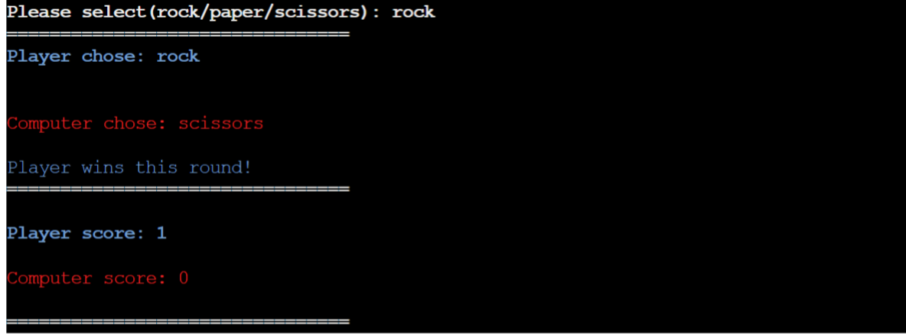
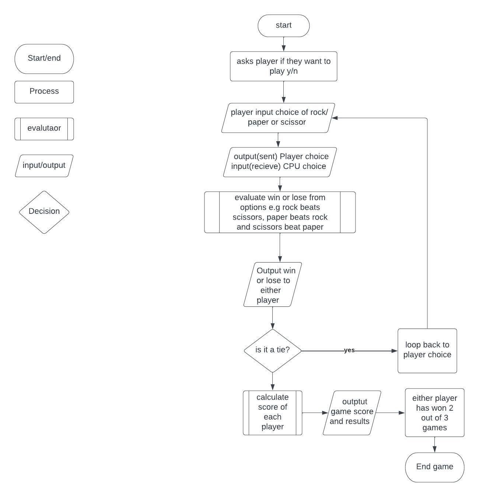
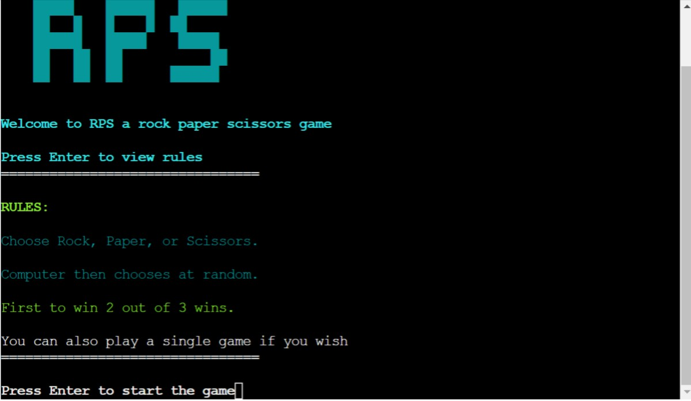

# **RPS(Rock, Paper, Scissors)**
## **Site Overview**
A simple 2 round game of rock paper scissors developed with python.
### [Click here to view deployed game](https://rock-paper-scissors.herokuapp.com/)

### [Click here to view repository](https://github.com/leebri101/rock-paper-scissors)

## Contents-Page:
1. [**Site Overview**](#site-overview)
    * [**How-to-Play:**](how-to-play)
1. [**Project-Planning**](#project-planning)
    * [**Target Audiences:**](#target-audiences)
    * [**User Stories**](#user-stories)
    * [**How Is This Will Be Achieved:**](#how-will-this-be-achieved)
    * [**Flow-chart**](#flow-chart)
1. [**Current Features on all pages**](#current-features-on-all-pages)
    * [*Title*](#Title)
        * [*Call To Action Button*](#call-to-action-button)
        * [*Start Game Section*](#start-game-section)
      * [**Quiz-Section**:](#quiz-section)
          * [*Quiz-Tracker*](#quiz-tracker)
      * [**Questions and Answers**:](#questions-and-answers)
          * [*Q and A*](#q-and-a)
    * [**Point-Tracker**](#point-tracker)
    * [**Results-Section**](#results-section)
    * [**Footer**](#footer)
    * [**Typsetting**](#typesetting)
1. [**Potential-Features**](#future-enhancements)
1. [**Testing Phase**](#testing-phase)
1. [**Deployment**](#deployment)
1. [**Credits**](#credits)
    * [**Honorable mentions**](#honorable-mentions)
    * [**General reference:**](#general-reference)
    * [**Content**](#content)
    * [**Media**](#media)
***
## **How to play:**
* Follow any on-screen instructions to enter the moves permitted (Rock, Paper, or Scissors.)
* After each round the winner is declared.
* Once either player wins twice the oevrall winner will be displayed.
* You will then be prompted to play again or exit the game.
* You can also play a single game if you wish

## **Project Planning**
### **Target Audiences:**
* For users who are interesting in a playing short games.
* For users who want to play a simple game of static rock paper scissors

### **User Stories:**
* As a user I want to be able to enjoy the game.
* As a user I want to enjoy playing a short game.
* As a user i want to undersatnd how easy it is to playthe game with no hard instuctions.

### **How will this be achieved:**
* Create a unique way of playing the game so that is not fixed the player winning.
* So that there is a real probability that it is based on pure luck and not coding to ensure fair gameplay.
* Consistent gameplay so that the user has the option to continue the game or to quit.  

### **Flow-chart**
* To have a better understanding of the game, I have created a flow chart outlining the process it goes through which has been created from [Lucid Chart](https://lucid.app/documents#/documents?folder_id=recent).

***
## **Current Features on all pages**

#### **Start Game Section:**
* A simple design which was made from patorjk.com (as mentioned in the media section) consisting of ascii art to match the theme of an 8bit game to bring nostalgia.

### **Quiz-Section**:
#### *Quiz-tracker:*
Features used:
* A indicator display to track the current question number the user is on out of the total quiz questions.
* A countdown timer with a animation which moves each time a second is lost within the alloted time length.
* A countdown bar to also track time but visually display the length of time left in the bar.

### **Questions and Answers**:
#### *Q and A:*
Features used:
* A question with a four choice option answer selector. 
* Users being able to select any answer before clicking next to proceed to the next question.
* Each answer having a hover animation with a color changing function,  the color also changes when the user clicks on answer. 
* The Fisher-Yates method used to shuffle all the questions and answers to any given random order out of ten. So no same question is used twice.

## **Point-Tracker**
* The point tracker is used to display to the user whether they have; answered the question correctly, gave an incorrect answer, did not give answer and to show which answer they are currently on.
* The point tracker is indicated in four different colors:
    * Green: Meaning the user has answered the question correctly.
    * Red: Meaning the user has answered incorrectly.
    * Gray: Meaning the user has ran out of time or can alternatively skip the question.
    * Yellow: To indicate to the user that they are on the current question.

## **Results-Section**
* The results sections shows the following things:
    * The users score out of 10.
    * A feedback message to the user as to whatever associated score they have recieved.
    * A Play Again button if the users wishes to replay the quiz again.

## **Potential-Features**
* Due to the project deadlines being in a very tight timeframe the project had to be scaled down to a more simpler version of the RPS game but these are the features that I would like to potentially add or implement in the near future:
    * An 8bit animation for the end game displays.
    * Potentially adding background behind the app.
    * 8bit music to go with theh gameplay

***
## **Testing-Phase**
Details of the testing phase are be found here: [TESTING.md](TESTING.md)
***

## **Deployment**

### **Heroku**
* Log into Heroku (creating an account if needed).
* Click the "New" button from the dashboard, under the header in the top right corner.
* Choose "Create new app."
* Enter your application name, which has to be unique. Then select your region and click "Create App."
* From your project page, click the "Settings" tab and scroll to "Config Vars."
* Enter "PORT" in the KEY input field, then enter "8000" in the VALUE input field.
* Click the "Add" button to add the Convig Vars.
* On the same page, scroll to the buildpacks section and click "Add Buildpack."
* Add the Python and node.js buildpacks, ensuring that the Python buildpack is listed above the node.js buildpack.
* Go back to the tabs at the top of the page, then select the "Deploy" tab.
* Select the Github deployment method.
* Search for your repository name, then click the "Connect" button to link your repository.
* At the bottom of that page, select deployment type: Automatic Deployment or Manual Deployment. 
* Automatic Deployment will redeploy the project to Heroku every time it is pushed to GitHun. Then wait for your project * to be deployed.

### **Forking the Repository on GitHub**
* Log in to GitHub and locate the GitHub Repository that you want to fork.
* In the upper right of the repository, click the "Fork" button.
* A copy of the repository will now be available within your repositories.
* Forking the GitHub repository makes a copy of the original repository on our GitHub account to view and/or make changes without affecting the original repository. 
* This copy of the code can be edited without affecting the original code.

## **Cloning the Repository on GitHub**
* In the upper section of the repository, click the dropdown named "Code."
* In the "Clone with HTTPS" section, copy the URL.
* Open Git Bash in your IDE of choice.
* Change the current working directory to the location you want for the cloned directory.
* Type "git clone" and paste the URL copied from GitHub.
* After pressing Enter, the clone of your repository will be created.
***

 ## **Credits**
### **Honorable mentions**
The third project was very a difficult challenge, which tested my understanding of python . However the more stuff that was being introduced to the project the more simpler and effective the project became due to time restraints of the course, but nonetheless it is a good way to show what i can do, but i must credit the following people:
 * [Can Sucullu](https://github.com/cansucullu) - My Code Institute mentor who is incredible at giving me insight and suggestions on further improving my project and is a huge help to continuously support me for any sort of technical issues within the project.
* Slack community of Code Institute for helping me with python module as it is somewhat challenging due to the deadline and questions on the module.
* Code Institute Tutors for assisting me with the technical aspects of the project i.e techical issues in regards to the coding. 
* Huge thanks to my girlfriend for the constant support.

### **General reference:**
* The project theme was inspired by the Code Institute's coding project called Love sandwiches. I have went by it as a general guide to ensure that i follow the formatting correctly upon deployment on heroku.
* I have used W3Schools for a basic understanding and tips for python for generic basic coding references and as general encyclopedia for any code related issues or ideas.

### **Media:**
* Lucid chart for flow chart creation:- https://www.lucidchart.com/pages/ 
* Hello World used as an idea on how to create the game:- https://thehelloworldprogram.com/python/python-game-rock-paper-scissors/
* Basic format of flow chart idea and also basis of rock paper scissor game:- https://learn.adafruit.com/rock-paper-scissors-circuitpython/design
* Ascii art generator:- http://patorjk.com/software/taag/#p=display&f=ANSI%20Regular&t=YOU%20WIN
* Ansi color code:- https://ozzmaker.com/add-colour-to-text-in-python/
* More info for ansi color codes:- https://www.lihaoyi.com/post/BuildyourownCommandLinewithANSIescapecodes.html#256-colors