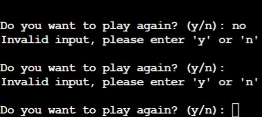
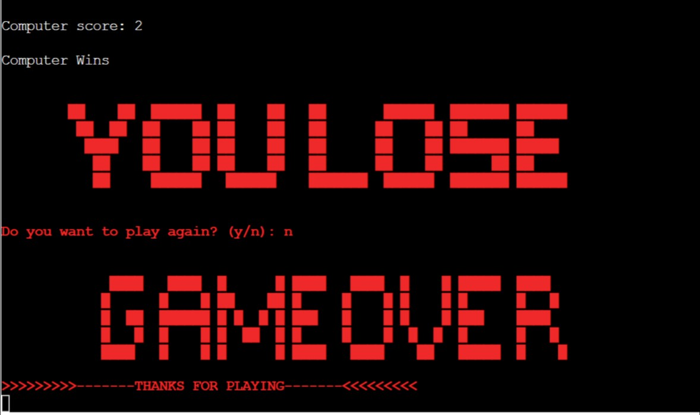

# **RPS(Rock, Paper, Scissors)**
## **Site Overview**
A simple 2 round game of rock paper scissors developed with python.
### [Click here to view deployed game](https://rock-paper-scissors.herokuapp.com/)

### [Click here to view repository](https://github.com/leebri101/rock-paper-scissors)

## Contents-Page:
1. [**Site Overview**](#site-overview)
    * [**How-to-Play:**](how-to-play)
1. [**Project-Planning**](#project-planning)
    * [**Target Audiences:**](#target-audiences)
    * [**User Stories**](#user-stories)
    * [**How Is This Will Be Achieved:**](#how-will-this-be-achieved)
    * [**Flow-chart**](#flow-chart)
1. [**Current Features**](#current-features)
    * [*Title*](#Title)
        * [**Start Game Section**](#start-game-section)
        * [**Input-Handler**](#input-handler)
    * [**Results-Section**](#results-section)
1. [**Potential-Features**](#future-enhancements)
1. [**Testing Phase**](#testing-phase)
1. [**Deployment**](#deployment)
    * [**Heroku**](#heroku)
    * [**Basic Setup**](#basic-setup)

1. [**Credits**](#credits)
    * [**Honorable mentions**](#honorable-mentions)
    * [**General reference:**](#general-reference)
    * [**Content**](#content)
    * [**Media**](#media)
***
## **How to play:**
* Follow any on-screen instructions to enter the moves permitted (Rock, Paper, or Scissors.)
* After each round the winner is declared.
* Once either player wins twice the oevrall winner will be displayed.
* You will then be prompted to play again or exit the game.
* You can also play a single game if you wish

## **Project Planning**
### **Target Audiences:**
* For users who are interesting in a playing short games.
* For users who want to play a simple game of static rock paper scissors

### **User Stories:**
* As a user I want to be able to enjoy the game.
* As a user I want to enjoy playing a short game.
* As a user i want to undersatnd how easy it is to playthe game with no hard instuctions.

### **How will this be achieved:**
* Create a unique way of playing the game so that is not fixed the player winning.
* So that there is a real probability that it is based on pure luck and not coding to ensure fair gameplay.
* Consistent gameplay so that the user has the option to continue the game or to quit.  

### **Flow-chart**
* To have a better understanding of the game, I have created a flow chart outlining the process it goes through which has been created from [Lucid Chart](https://lucid.app/documents#/documents?folder_id=recent).

***
## **Current Features**
### **Start Game Section:**
* A simple design which was made from patorjk.com (as mentioned in the media section) consisting of ascii art to match the theme of an 8bit game to bring back nostalgia.

### **Input-Handler:**
* An Input handler has been put in place to allow any invalid entries to prompt the user to type or enter in the correct instruction.

## **Results-Section**
* The results sections shows the following things:
    * Who won overall between the player and computer.
    * A score in place to keep track of both players
    * A winning display of either player, if the user wins it will display a prompt and ascii art.
    * It also has input handler for the user if they wish to continue to play the game or not which it will loop back to the beginning.(Which is linked in wit the End-Game results)

## **End-Game**
* If the user wishes to not continue it will bve shown a nostaligic game over ascii art which thanks the user for their time in playing the game.
* At this instance the user will need to restart the app if they wish to replay the game.

## **Potential-Features**
* Due to the project deadlines being in a very tight timeframe the project had to be scaled down to a more simpler version of the RPS game but these are the features that I would like to potentially add or implement in the near future:
    * An 8bit animation for the end game displays.
    * Potentially adding background behind the app.
    * 8bit music to go with the gameplay.
    * A Possibility of adding more players to allow for a turn based game.
***

## **Testing-Phase**
Details of the testing phase are be found here: [TESTING.md](TESTING.md)

***
## **Deployment**
### **Heroku**
### **Basic Setup:**
* Users must first log into Heroku (creating an account if needed).
* Then click the "New" button from the dashboard, on the top right hand corner.
* Then choose "Create a new app".
* Next Enter a unique name for you application, then select the region and click "Create app".
### **Technical Setup:**
* Then from your project page, click on the "Settings" tab scroll down to the area which says "Config Vars".
* YOU MUST DO THESE STEPS CAREFULLY TO ENSURE IT WORKS PROPERLY:
    * Enter "PORT" in the "KEY" input field and then enter "8000" within the "VALUE" input field.
    * Click the "ADD" button to add the "Convig Vars".
    * Within the same page, scroll to the buildpacks sections and click "ADD BUILDPACK".
    * Add the "Python" and "node.js" buildpack, and to ensure that the python pack is above the node.js pack if not you can slide them into teh stated order.
### ***Deployment of Heroku:***
* Go at the tabbbed section on the top of the page and select the "DEPLOY" tab.
* Select GitHub deployment method.
* Search for your respository namne, (keep in mind that it must be the exact same as how you first named the repository) then click the "CONNECT" button to link the repository.
* At the bottom of the page, select deployment type of either "Automatic" or "Manual Deployment".
* If you have chosen Automatic Deployment then it will re-deploy the project to heroku each time something is pushed onto GitHub.
* Then it will display a message that your app is fully deployed and you will have a link to preview and test it. 

### **Forking the Repository on GitHub**
* Log in to GitHub and locate the GitHub Repository that you want to fork.
* In the upper right of the repository, click the "Fork" button.
* A copy of the repository will now be available within your repositories.
* Forking the GitHub repository makes a copy of the original repository on our GitHub account to view and/or make changes without affecting the original repository. 
* This copy of the code can be edited without affecting the original code.

## **Cloning the Repository on GitHub**
* In the upper section of the repository, click the dropdown named "Code."
* In the "Clone with HTTPS" section, copy the URL.
* Open Git Bash in your IDE of choice.
* Change the current working directory to the location you want for the cloned directory.
* Type "git clone" and paste the URL copied from GitHub.
* After pressing Enter, the clone of your repository will be created.
***

 ## **Credits**
### **Honorable mentions**
Python is a an extremely challenging coding langauge at which it can be so simple yet so powerful it truly is an interesting and useful language, it brought back memories at which i wanted to create an in-text-rpg where it was as simple a  3v3 charater game with normal, attacks, spells and items to use which is proven to be extremely difficult, but nonetheless it is a good way to show what i can do, but i must credit the following people:
 * [Can Sucullu](https://github.com/cansucullu) - My Code Institute mentor who is incredible at giving me insight and suggestions on further improving my project and is a huge help to continuously support me for any sort of technical issues within the project.
* Slack community of Code Institute for helping me with python module as it is somewhat challenging due to the deadline and questions on the module.
* Code Institute Tutors for assisting me with the technical aspects of the project i.e techical issues in regards to the coding. 
* Huge thanks to my girlfriend for the constant support.

### **General reference:**
* The project theme was inspired by the Code Institute's coding project called Love sandwiches. I have went by it as a general guide to ensure that i follow the formatting correctly upon deployment on heroku.
* I have used W3Schools for a basic understanding and tips for python for generic basic coding references and as general encyclopedia for any code related issues or ideas.

### **Media:**
* Lucid chart for flow chart creation:- https://www.lucidchart.com/pages/ 
* Hello World used as an idea on how to create the game:- https://thehelloworldprogram.com/python/python-game-rock-paper-scissors/
* Basic format of flow chart idea and also basis of rock paper scissor game:- https://learn.adafruit.com/rock-paper-scissors-circuitpython/design
* Ascii art generator:- http://patorjk.com/software/taag/#p=display&f=ANSI%20Regular&t=YOU%20WIN
* Ansi color code:- https://ozzmaker.com/add-colour-to-text-in-python/
* More info for ansi color codes:- https://www.lihaoyi.com/post/BuildyourownCommandLinewithANSIescapecodes.html#256-colors