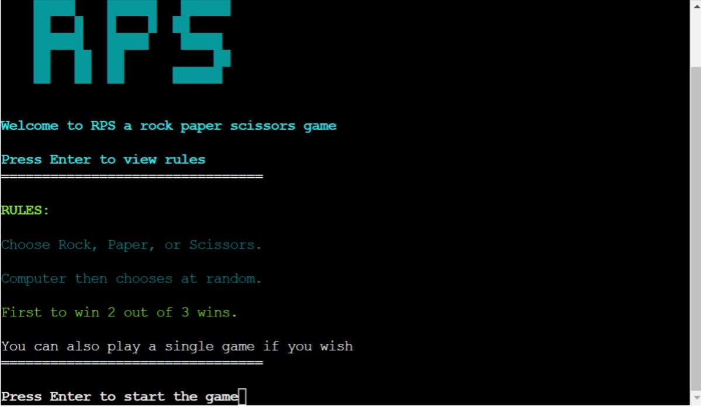

# **Testing**
* [**Testing**](#testing)
  * [**Manual Testing:**](#manual-testing)
    * [***Inputs:***](#inputs)
    * [***Game-Play:***](#game-play)
  * [**Bugs**](#bugs)
    * [**Known Bugs**](#known-bugs)
  * [**Post Development Testing**](#post-development-testing)
    * [**Validators**](#validators)
      * [***Python:*** - https://pep8ci.herokuapp.com/#](#python---httppep8onlinecom)

## **Manual Testing:** 
During the testing phase of the game I have used the following things through out the time:

### ***Inputs:***
I have tested all sorts of inputs with strings upon gameplay to see if there are any issues or breaks.
I have also asked my girlfriend to help with the experiment by letting her freely play the game as it is and if any misinput was in place all of them would print out a
Lastly, i have asked several people to break the app itself but it was not possible.

### ***Game Play:***
Throughout development, I was testing the game in the terminal of VScode as well as several playing multiple rounds in the Code Institute terminal template for each deployment to Heroku.
Throughout the development phase, I was manually testing the game through different IDE's like Code Institutes terminal and code anywhere.
The results where a fully functional game with minor cosmetic issues of the layout.

## **Bugs**
* ***Issue Found:***
    * Loop of display of rule after each game 
* ***Causes:*** 
    * Coding and placements to try and hide the rules after the first or second game.
     
### **Known Bugs:**
* Loop of display of rule after each game as it only does a cosmetic affect to the user and not serious damage to the code it does not affect.
* The overall gameplay of the game itself. 

## **Post Development Testing**
### **Validators**

#### ***Python:*** - https://pep8ci.herokuapp.com/#
* Due to the downfall of PEP8 online all testing for PEP8 was done by Code institutes hand crafted version of PEP8 which returned no errors.

[return to README.md](README.md)
